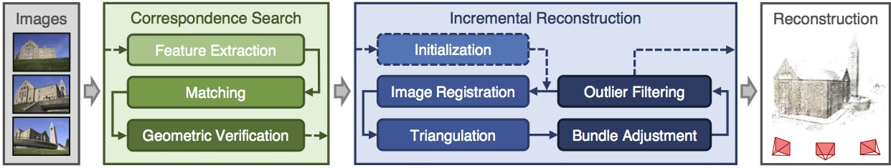
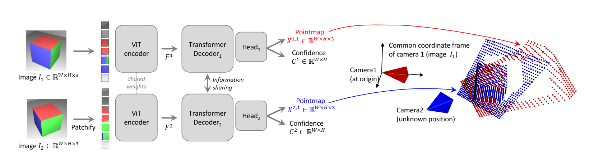
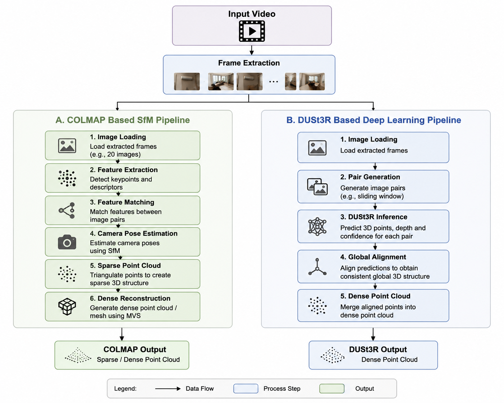
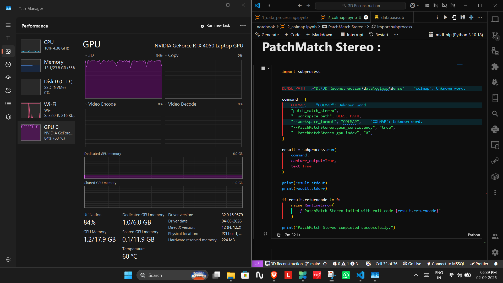
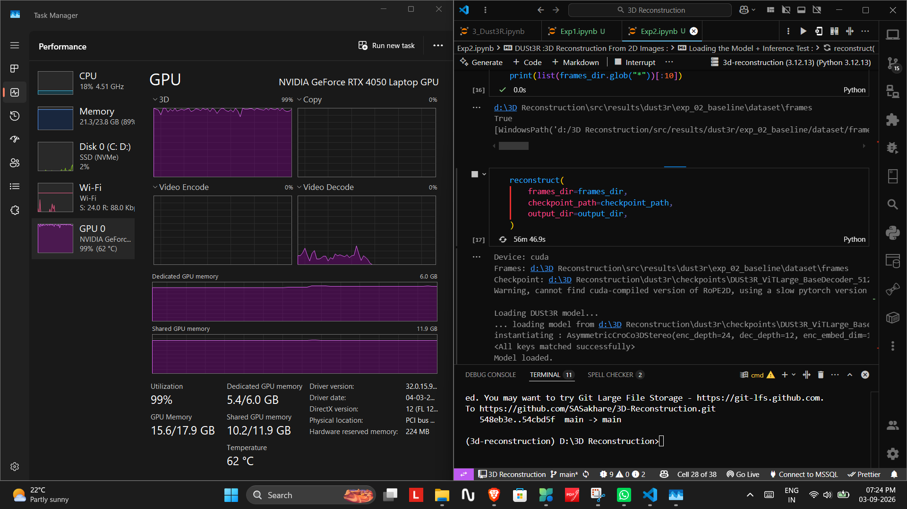
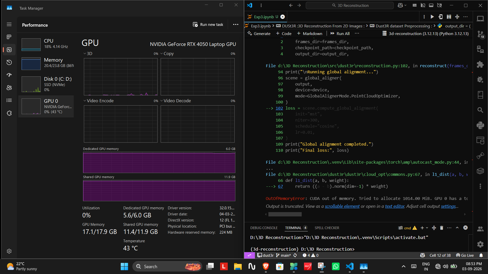

# 3D Reconstruction Pipeline

### Reconstruction of Sparse and Dense 3D Point Clouds from Video Sequences using Computer Vision and Deep Learning

[](https://www.python.org/)
[](https://pytorch.org/)
[](https://developer.nvidia.com/cuda-toolkit)
[](https://docs.astral.sh/uv/)
[](https://claude.ai/chat/2c107617-eaa6-457f-82aa-c87675bf177c#license)

This project implements a complete **3D reconstruction pipeline** that converts a monocular video sequence into a 3D scene representation, comparing a **traditional geometry-based approach (COLMAP)** against a  **deep learning based approach (DUSt3R)** .

---

## Table of Contents

* [Overview](https://claude.ai/chat/2c107617-eaa6-457f-82aa-c87675bf177c#overview)
* [Reconstruction Approaches](https://claude.ai/chat/2c107617-eaa6-457f-82aa-c87675bf177c#reconstruction-approaches)
* [Repository Structure](https://claude.ai/chat/2c107617-eaa6-457f-82aa-c87675bf177c#repository-structure)
* [Environment Setup](https://claude.ai/chat/2c107617-eaa6-457f-82aa-c87675bf177c#environment-setup)
* [GPU / CUDA Setup](https://claude.ai/chat/2c107617-eaa6-457f-82aa-c87675bf177c#gpu--cuda-setup)
* [Model Setup](https://claude.ai/chat/2c107617-eaa6-457f-82aa-c87675bf177c#model-setup)
* [Running the Pipeline](https://claude.ai/chat/2c107617-eaa6-457f-82aa-c87675bf177c#running-the-pipeline)
* [Results](https://claude.ai/chat/2c107617-eaa6-457f-82aa-c87675bf177c#results)
* [Visualizing Point Clouds (.ply)](https://claude.ai/chat/2c107617-eaa6-457f-82aa-c87675bf177c#visualizing-point-clouds-ply)
* [Notebooks](https://claude.ai/chat/2c107617-eaa6-457f-82aa-c87675bf177c#notebooks)
* [Proof of Execution](https://claude.ai/chat/2c107617-eaa6-457f-82aa-c87675bf177c#proof-of-execution)
* [Development Tools](https://claude.ai/chat/2c107617-eaa6-457f-82aa-c87675bf177c#development-tools)
* [Future Work](https://claude.ai/chat/2c107617-eaa6-457f-82aa-c87675bf177c#future-work)
* [Author](https://claude.ai/chat/2c107617-eaa6-457f-82aa-c87675bf177c#author)

---

## Overview

The input to the system is a  **monocular RGB video** . The video is split into frames, which are then processed by two independent reconstruction pipelines so their outputs can be compared.

```
Input Video
    |
    v
Frame Extraction
    |
    v
Image Frames
    |
    ├──────────────┐
    v              v
 COLMAP          DUSt3R
 SfM Pipeline    Deep Learning Pipeline
    |              |
    v              v
Sparse / Dense   Dense 3D
Point Cloud      Point Cloud
```

---

## Reconstruction Approaches

### 1. COLMAP — Traditional Structure-from-Motion

COLMAP performs classical **Structure-from-Motion (SfM)** and **Multi-View Stereo (MVS)** reconstruction using feature extraction, matching, and triangulation.

```
Image Frames → Feature Extraction → Feature Matching
            → Camera Pose Estimation
            → Sparse Reconstruction
            → Dense Point Cloud Generation
```


*COLMAP pipeline: correspondence search (feature extraction, matching, geometric verification) followed by incremental reconstruction (initialization, image registration, triangulation, bundle adjustment, outlier filtering) to produce the final 3D reconstruction.*

**Outputs:** camera pose estimation, sparse reconstruction, dense point cloud, `.ply` files.

### 2. DUSt3R — Deep Learning Based Reconstruction

DUSt3R uses a transformer-based neural network to predict dense 3D geometry directly from image pairs, without manual feature matching.

```
Image Frames → Image Pair Generation → DUSt3R Inference
            → 3D Prediction
            → Global Alignment
            → Dense Point Cloud
```


*DUSt3R architecture: each image is encoded by a shared-weight ViT encoder, then decoded by per-view transformer decoders that exchange information, producing a pointmap and confidence map per image. Both pointmaps are expressed in a common coordinate frame (anchored at Camera 1), directly giving relative camera pose and dense 3D structure without explicit feature matching.*

**Outputs:** dense 3D predictions, richer scene coverage, visualization videos.

---

## Repository Structure

```
3D-Reconstruction
│
├── src
│   ├── preprocessing/       # Video → frame extraction
│   ├── dust3r/               # DUSt3R data processing, model manager, reconstruction
│   ├── pipeline/              # COLMAP pipeline
│   ├── results/
│   └── utils/
│
├── data/                      # Input videos / frames
│
├── dust3r/
│   └── checkpoints/           # Pretrained DUSt3R model weights
│
├── best_results/
│   └── colmap/
│       ├── dense_10fps_exhaustic.ply
│       ├── dense_20fps_sequential.ply
│       └── dense_30fps_sequential.ply
│
├── notebook/
│   ├── 1_data_processing.ipynb
│   ├── 2_colmap.ipynb
│   ├── 2_colmap-2.ipynb
│   ├── 3_Dust3R.ipynb
│   ├── 4_visulize_point_cloude.ipynb
│   └── Dust3R_Experiment/
│
├── image-proof/
│   ├── colmap.png
│   ├── colmap-1.png
│   ├── colmap-2.png
│   ├── dust3r.png
│   ├── dust3r-1.png
│   ├── cuda-error.png
│   └── reconstruction_pipeline.png
│
├── main.py
├── pyproject.toml
├── uv.lock
└── README.md
```

---

## Environment Setup

### 1. Clone the Repository

```bash
git clone https://github.com/SASakhare/3D-Reconstruction.git
cd 3D-Reconstruction
```

### 2. Install UV (if not already installed)

```bash
pip install uv
```

### 3. Create a Python 3.12 Environment

```bash
uv venv --python 3.12
```

### 4. Activate the Environment

**Windows**

```bash
.venv\Scripts\activate
```

**Linux / macOS**

```bash
source .venv/bin/activate
```

### 5. Install Dependencies

```bash
uv sync
```

`uv sync` reads `pyproject.toml` and `uv.lock` and installs a fully reproducible environment.

---

## GPU / CUDA Setup

Configuration used for this project:

| Component | Configuration                      |
| --------- | ---------------------------------- |
| GPU       | NVIDIA GeForce RTX 4050 Laptop GPU |
| VRAM      | 6 GB                               |
| CUDA      | 11.8                               |
| PyTorch   | 2.7.0                              |

Install CUDA-enabled PyTorch:

```bash
uv pip install torch torchvision --index-url https://download.pytorch.org/whl/cu118
```

Verify the GPU is detected:

```bash
nvidia-smi
```

Verify PyTorch can see CUDA:

```bash
python -c "import torch; print(torch.__version__); print(torch.cuda.is_available()); print(torch.version.cuda); print(torch.cuda.get_device_name(0))"
```

Expected output:

```
CUDA Available: True
GPU: NVIDIA GeForce RTX 4050 Laptop GPU
```

---

## Model Setup

Download the pretrained **DUSt3R** checkpoint and place it inside:

```
dust3r/checkpoints/
```

The pipeline automatically loads the checkpoint and transfers it to the GPU during inference.

---

## Running the Pipeline

Extract frames and run the reconstruction pipeline:

```bash
python main.py
```

The extracted frames are used as input for **both** the COLMAP and DUSt3R pipelines.

---

## Results

All generated results (point clouds + demonstration videos) are hosted on Google Drive.

### COLMAP Results

📁 **[Download COLMAP Reconstruction Results](https://drive.google.com/drive/folders/1YTYF-pTCqnG5ifucYpAdqanyrZXNxP6c?usp=sharing)**

```
COLMAP
├── dense_10fps_exhaustic.ply
├── dense_20fps_sequential.ply
└── dense_30fps_sequential.ply
```

### DUSt3R Results

📁 **[Download DUSt3R Reconstruction Results](https://drive.google.com/drive/folders/13Hgloed1t5oUmZSk8Awy2KVjI3A6l9Kk?usp=sharing)**

Each sub-folder is a separate experiment configuration, e.g.:

```
Exp-1-20frames_inter300
Exp-2-100frames_inter300
Exp-4-120frames_inter300
Exp-5-50frames_inter300_swin-5
Exp-6-40frames_inter500_swin-6
```

Each experiment folder contains:

```
Experiment Folder
├── point_cloud.ply
└── visualization_video
```

### GitHub Repository

🔗 **[SASakhare/3D-Reconstruction](https://github.com/SASakhare/3D-Reconstruction)**

---

## Visualizing Point Clouds (.ply)

You can open the generated `.ply` files with any of the following:

* [Open3D](http://www.open3d.org/)
* [MeshLab](https://www.meshlab.net/)
* [CloudCompare](https://www.danielgm.net/cc/)

### Or use the included notebook

This repo ships a ready-to-use notebook for visualization:

```
notebook/4_visulize_point_cloude.ipynb
```

**Steps:**

1. Download the `.ply` file(s) you want from the Results links above (or use the ones in `best_results/colmap/`).
2. Open `notebook/4_visulize_point_cloude.ipynb`.
3. Change the file path variable to point to your `.ply` file:
   ```python
   ply_path = "path/to/your/file.ply"
   ```
4. Run all cells — the notebook will load and render the point cloud.

That's it — no other setup is needed to visualize a result.

---

## Notebooks

| Notebook                                | Purpose                                  |
| --------------------------------------- | ---------------------------------------- |
| `1_data_processing.ipynb`             | Video preprocessing and frame extraction |
| `2_colmap.ipynb`/`2_colmap-2.ipynb` | COLMAP reconstruction experiments        |
| `3_Dust3R.ipynb`                      | DUSt3R reconstruction experiments        |
| `4_visulize_point_cloude.ipynb`       | Load and visualize `.ply`point clouds  |

---

## Proof of Execution

Screenshots demonstrating successful execution are stored in [`image-proof/`](https://claude.ai/chat/image-proof).

**Overall Reconstruction Pipeline**



**COLMAP Pipeline Execution**



**DUSt3R Pipeline Execution**



**CUDA / GPU Verification**



---

## Development Tools

| Tool               | Usage                  |
| ------------------ | ---------------------- |
| Visual Studio Code | Development            |
| GitHub             | Version control        |
| Overleaf (LaTeX)   | Report preparation     |
| Google Drive       | Result storage         |
| ChatGPT            | Development assistance |

---

## Future Work

* Higher resolution input frames
* Larger GPU / VRAM for higher-fidelity DUSt3R inference
* MAST3R based reconstruction
* Real-time reconstruction pipeline

---

## Author

**Sejal Sakhare**
B.Tech, Electronics and Communication Engineering — IIIT Nagpur
Computer Vision and AI Based 3D Reconstruction Study

[GitHub](https://github.com/SASakhare) · [Project Repository](https://github.com/SASakhare/3D-Reconstruction)

---

## License

This project is released under the MIT License. See [LICENSE](https://claude.ai/chat/LICENSE) for details.
